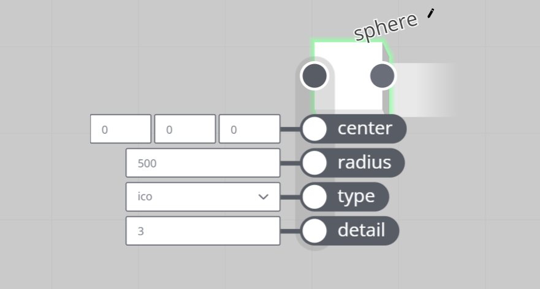
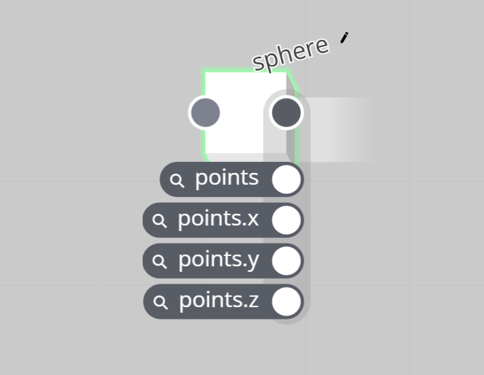
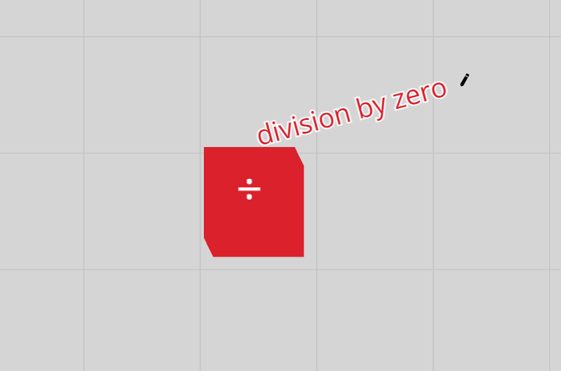

# Node

---

A node within a [graph](/concepts/GeneralConcepts/graph.md) represents a function.

Each node has a defined set of input and output properties.

### Node Input

A node has a defined set of inputs, or input properties. Node input properties can be considered the arguments to the function that the node represents. For example: the _radius_ input of a [**sphere**](/nodes/PolySphere/documentation.md) node. Internally this is a float value argument to the function that creates the sphere.

  

Node inputs can be set directly, but also by other nodes through [connections](/concepts/GeneralConcepts/connection.md).

For more specifics, see node [input and output types](/concepts/GeneralConcepts/inputOutput.md).

### Node Output

A node also has a defined set of outputs, or output properties. The [property values](/concepts/GeneralConcepts/inputOutput.md) can be considered the result of executing the function that the node represents.

  

Output values are calculated on compute.

For more specifics, see node [input and output types](/concepts/GeneralConcepts/inputOutput.md).

### Node Error

Nodes can error when the engine has been unable to successfully compute the output of a node. This could be due to a combination of inputs which is impossible to solve, or an internal operator error.

An errored node will cause downstream nodes to error as well, sometimes invalidating the graph's output. Care needs to be taken to avoid putting nodes in an errored state. To un-error an errored node, change its input value(s), which sometimes requires changing upstream node inputs.

An example is dividing by zero using the [**divide**](/nodes/Divide/documentation.md) node.

  

Errors can be 'caught' using graph logic, by the [**error check**](/nodes/Error/documentation.md) node.
