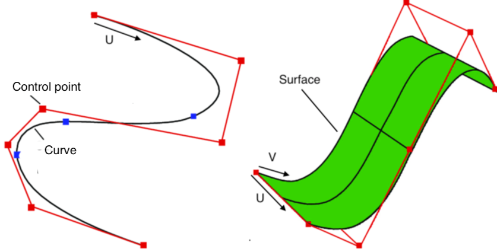

# NURBS curve

---

A NURBS curve is a [primitive](/concepts/GeneralConcepts/primitive.md) representing a 3D <a href="https://en.wikipedia.org/wiki/Non-uniform_rational_B-spline" target="_blank">NURBS</a> curve. These curves are smooth mathematical spline interpolations of a set of control points. A NURBS curve is parametrised along a U coordinate, varying between `0` and `1`.

A NURBS curve has following notable properties:

* _control points_: a list of 3D vectors representing the 3D coordinates of the points that define the curves's mathematical spline function.
* _order_: a positive integer defining the number of nearby control points that influence any given point on the curve. Practically: the higher the number, the smoother the curve. Order 2 effectively turns the curve into a polyline connecting the control points with straight line segments.

  

For more indepth information on how weights of NURBS curves work, visit here: <a href="https://pages.mtu.edu/~shene/COURSES/cs3621/NOTES/spline/NURBS/NURBS-mod-weight.html" target="_blank">modifying NURBS curve weights</a>. This can be done in the graph with the use of the [**set point weight**](/nodes/SetPointWeight/documentation.md) node.