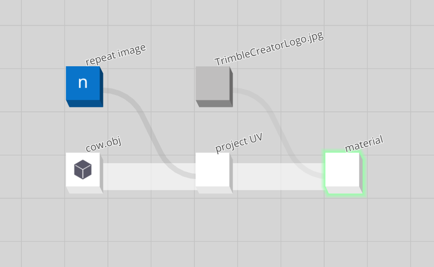

# Output Node

Any node (or set of nodes) can be tagged as the output of a graph by left-clicking the node itself. This will enforce compute of these nodes by the Materia engine. The computed output of these nodes can be considered the desired output of a graph.

Modification to the graph state will trigger a graph evaluation, and potentially compute.

  

In the graph depicted above, the green highlighted **material** node is set to be an output, and as such, computed.

It is possible for multiple nodes to be set to be the graph's output (by holding the SHIFT key when output selecting nodes), in which case both of the output selected nodes will be computed.