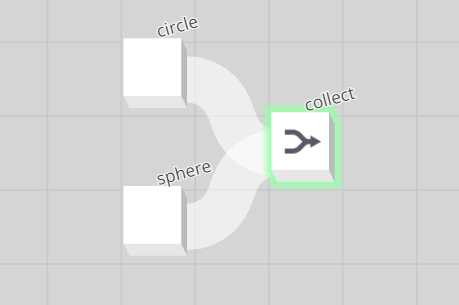
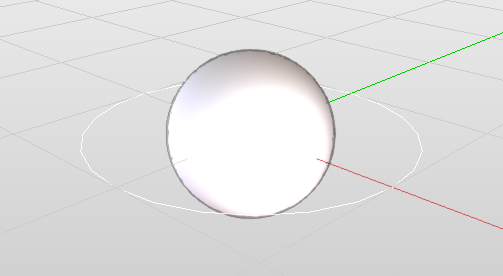
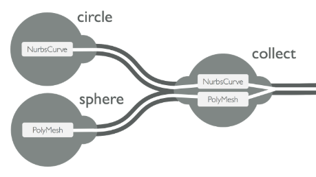

## Primitive

**_Primitives are Trimble Creator's computed entities._**

They are created and transformed by nodes, and flow through the nodes and connections of a graph.

> Examples of primitives:
> 
> * `PolyMesh`: a 3D polygonal mesh primtive.
> * `NURBS curve` and `NURBS surface`: a <a href="https://en.wikipedia.org/wiki/Non-uniform_rational_B-spline" target="_blank">NURBS</a> curve and NURBS surface primitive.

Consider this graph:

  

The **Circle** node creates a NURBS curve primitive, and the **Sphere** node creates a PolyMesh primitive.

  

Both primitives get passed downstream to the **Collect** node. In its turn, the **Collect** node passes the two collected primitives on downstream to any node connected to its output.

  

In this case, the primitives pass through the **Collect** node unchanged, but other node types have the ability to transform and modify incoming primitives. Example: an **Extrude** node will extrude the polygons of any incoming PolyMesh primitive, but not NURBS curve primitives.