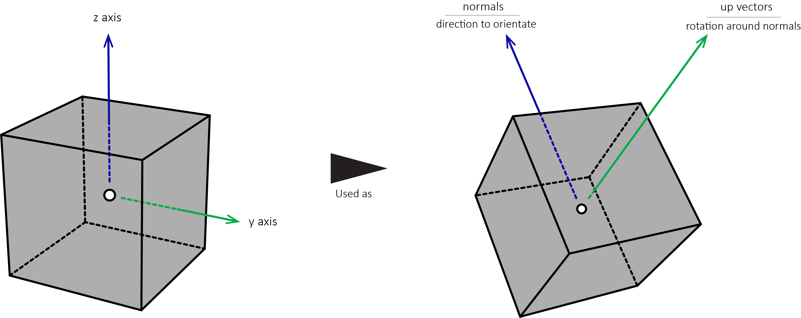

# Copy using vectors

**_Copies primitives based on lists of input vectors._**

---

#### Inputs

* **_geometry_**

  * Accepts a single geometry connection (unless the SHIFT key is held).

* _positions_

  * The position(s) to copy input primitives to.

* _normals_

  * The direction(s) that copied input primitives will orientate themselves towards.

* _up vectors_

  * The rotation(s) that copied input primitives will orientate themselves to (based on the direction set by the _normals_ input). See the Note(s) section below for more information.

* _combine meshes_

  * Sets whether to combine all copied meshes into a singular mesh primitive. Only meshes are combined. Curves, NURBS surfaces, and other primitive types are ignored with this function.

* _mode_

  * Sets the mode in which the _normals_ and _up vectors_ inputs are applied to input primitives.
  
  * For example, when set to `4` X axis = tangent, Y axis = _up vectors_ input, and the Z axis = _normals_ input (in regards to the original orientation of the input primitives).

#### Outputs

* **_geometry_**

  * Output primitives.

* _points_

  * The list of points of the output primitives.

* _points.x_

  * The list of x values of the points of the output primitives.

* _points.y_

  * The list of y values of the points of the output primitives.

* _points.z_

  * The list of z values of the points of the output primitives.

#### Note(s)

* The _positions_, _normals_, and _up vectors_ inputs can be visualized like so (when using a polyline and the _mode_ input is set to `4`):

  

* Notes specific to the _mode_ input:

    * It is recommended to use _mode_ `4` as it is the intended function of the node. Modes `0` through `3` are considered deprecated, although will still work.

    * The tangent of the modes as described above in the _mode_ input section above is the resultant of the _normals_ and _up vectors_ inputs.

    * Often vector rotations are described in handedness or chirality (See <a href="https://en.wikipedia.org/wiki/Right-hand_rule" target="_blank">here</a> for more information). In regards to the different modes, modes `0` and `1` are left-handed whereas modes `2`, `3`, and `4` are right-handed.

* The _combine meshes_ input has the same function as the [**combine meshes**](/nodes/CombineMeshes/documentation.md) node with the _group behavior_ input set to `exclude meshes from groups`.

* Other names for this node include: Copy2, Duplicate, Instance, and Matrix.

#### Example(s)

* <a href="https://creator.trimble.com/?viewLayout=verticalSplit&assetURI=whp:925537ea-6e85-4883-b8ca-ddca2eabd1c8&version=latest" target="_blank">Copy using vectors</a>

* <a href="https://creator.trimble.com/graph?assetURI=whp:b9cbcf7c-7a42-4f0f-b5b3-69a9243d869a&version=latest" target="_blank">Loft along curve</a>
