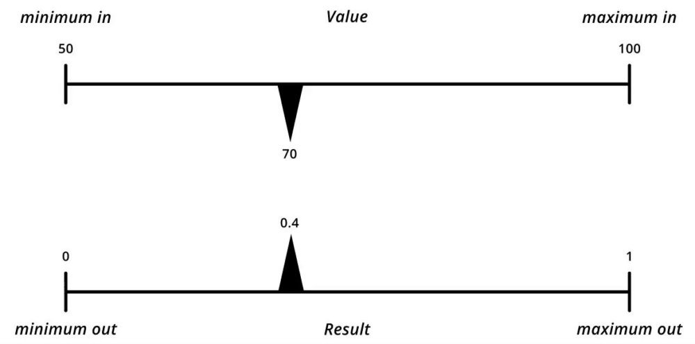

# Range

**_Remaps values of a given range to a new range._**

---

#### Inputs

* _value_

  * The value to remap.

* _minimum in_

  * The minimum of the range that the _value_ input sits within.

* _maximum in_

  * The maximum of the range that the _value_ input sits within.

* _minimum out_

  * The minimum of the new range that the _value_ input will be remapped to.

* _maximum out_

  * The maximum of the new range that the _value_ input will be remapped to.

#### Outputs

* _result_

  * The remapped value.

* _result list_

  * The list of remapped values.

### Note(s)

* An example of remapping a value with this node might look like this:

  

* Other names for this node include: Remap and Lerp.

### Example(s)

* <a href="https://creator.trimble.com/graph?assetURI=whp:27966e4f-e1dd-448a-b70f-08a20bedfd71&version=latest" target="_blank">Split a curve by length</a>
