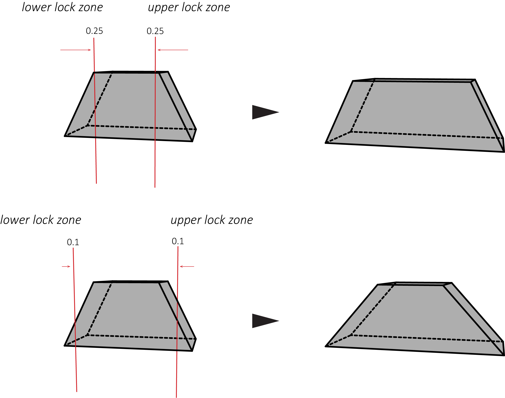

# Smart size

**_Rescales geometry while preserving features within set zones._**

---

### Inputs

* **_geometry_**

  * Accepts a single geometry connection (unless the SHIFT key is held).

* _axis_

  * Sets the axis in which input primitives are scaled. This can be `x`, `y`, or `z`.

* _size_

  * The size in which input primitives are scaled to.

* _reset size_

  * Resets the _size_ input back to the input primitives original size.

* _scale around_

  * Sets the bounds which input primitives are scaled around. This can be `min`, `center`, and `max`.

* _lower lock zone_

  * The lower lock zone coordinate (0 to 1) in which input primitive features are preserved.

* _upper lock zone_

  * The upper lock zone coordinate (0 to 1) in which input primitive features are preserved.

* _mask_

  * A list of boolean values that defines which input primitive points are scaled. If empty, all input primitive points will be scaled.

### Outputs

* **_geometry_**

  * Output primitives.

* _points_

  * The list of points of the output primitives.

* _points.x_

  * The list of x values of the points of the output primitives.

* _points.y_

  * The list of y values of the points of the output primitives.

* _points.z_

  * The list of z values of the points of the output primitives.

### Note(s)

* The scaling operation of the node works by only scaling the parts of the input primitives that are not within the range as defined by the _upper_ and _lower lock zones_. The parts of the input geometry that are outside of the specified range will have their features preserved.

  

* The lock zones are specified as a percentage (0 to 1) of the input primitives bounds. The lower lock zone is taken from the minimum bounds of the axis specified by the _axis_ input, whereas the upper lock zone is taken from the maximum bounds.

  * Therefore the sum of both the upper and lower lock zones cannot be greater or equal to `1` so that these zones do not overlap.

* Other names for this node include: SmartSize.

### Example(s)

* <a href="https://creator.trimble.com/graph?assetURI=whp:963ff4b1-f668-4209-8e2c-76c390779340&version=latest" target="_blank">Smart size lock zones</a>
* <a href="https://creator.trimble.com/graph?assetURI=whp:e59e4e0a-4c00-475c-ac15-5794ab89d834&version=latest" target="_blank">Smart sizing geometry</a>